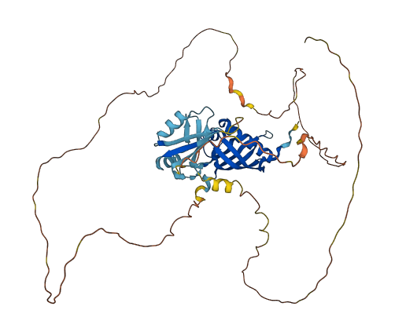

# Phosphoproteomics

This repository covers some bioinformatics analysis applied to phosphoproteomics study.

<div align="center">
  <br>
  <em>Ras GTPase-activating protein-binding protein 2 (G3BP2) predicted by AlphaFold2. This protein has several ubiquitination sites annotated in PhosphoSitePlus.
</em>
</div>


- [Phosphoproteomics](#phosphoproteomics)
- [Instalation dependencies](#instalation-dependencies)
- [Notebooks](#notebooks)
- [Useful databases for PTM analysis](#useful-databases-for-ptm-analysis)
- [Author](#author)
- [License](#license)

# Instalation dependencies

Install dependencies with [mamba](https://mamba.readthedocs.io/en/latest/)

```sh
mamba create --name phosphoproteomics python=3 pandas matplotlib numpy biopython plotly pypdb
```

# Notebooks

- [01_file-processing.ipynb](notebooks/01_file-processing.ipynb): File processing.
- [02_structural-characterization.ipynb](notebooks/02_structural-characterization.ipynb): Structural characterization of phosphorylation sites: analysis of the region, secondary structure and accessibility of the phospho-S/T/Y peptides.
- [03_motif-analysis.ipynb](notebooks/03_motif-analysis.ipynb): Phosphorylation motif analysis classification.
- [04_biochemical-properties-analysis.ipynb](notebooks/04_biochemical-properties-analysis.ipynb): Are the phospho-peptides: Acidic-, basic-,proline-,asparagine-, or hydrophobic-directed?
- [05_clustering-analysis.ipynb](notebooks/05_clustering-analysis.ipynb): PTM clusters analysis.
- [06_motifX.ipynb](notebooks/06_motifX.ipynb): Identification of new motifs with MotifX.

# Useful databases for PTM analysis

- [dbPTM](https://awi.cuhk.edu.cn/dbPTM/): an integrated resource for protein post-translational modifications (PTMs).
- [disprot](https://www.disprot.org/): database of intrinsically disordered proteins.
- [MobiDB](https://mobidb.bio.unipd.it/):  a database of protein disorder and mobility annotations.
- Ochoa, D., Jarnuczak, A.F., Viéitez, C. et al. The functional landscape of the human phosphoproteome. Nat Biotechnol 38, 365–373 (2020). https://doi.org/10.1038/s41587-019-0344-3
- [Phospho.ELM](http://phospho.elm.eu.org/): a database of S/T/Y phosphorylation sites.
- [PhosphoSitePlus](https://www.phosphosite.org): information and tools for the study of protein post-translational modifications (PTMs)
- [ProteomeScout](https://proteomescout.wustl.edu/): database of proteins and post-translational modifications.
- [PTMcode 2](https://ptmcode.embl.de/): known and predicted functional associations between protein post-translational modifications (PTMs).
- [Qoukka](quokka.erc.monash.edu): webserver for prediction of kinase family-specific phosphorylation sites.
- [Uniprot](https://www.uniprot.org/): comprehensive, high-quality and freely accessible resource of protein sequence and functional information

# Author
Fernando Pozo - [@fpozoca](https://twitter.com/fpozoca) - [Google Scholar](https://scholar.google.com/citations?user=3YLw4PQAAAAJ&hl=en) – fpozoc@gmx.com - [github.com/fpozoc](https://github.com/fpozoc)

# License
See `LICENSE` [file](LICENSE).